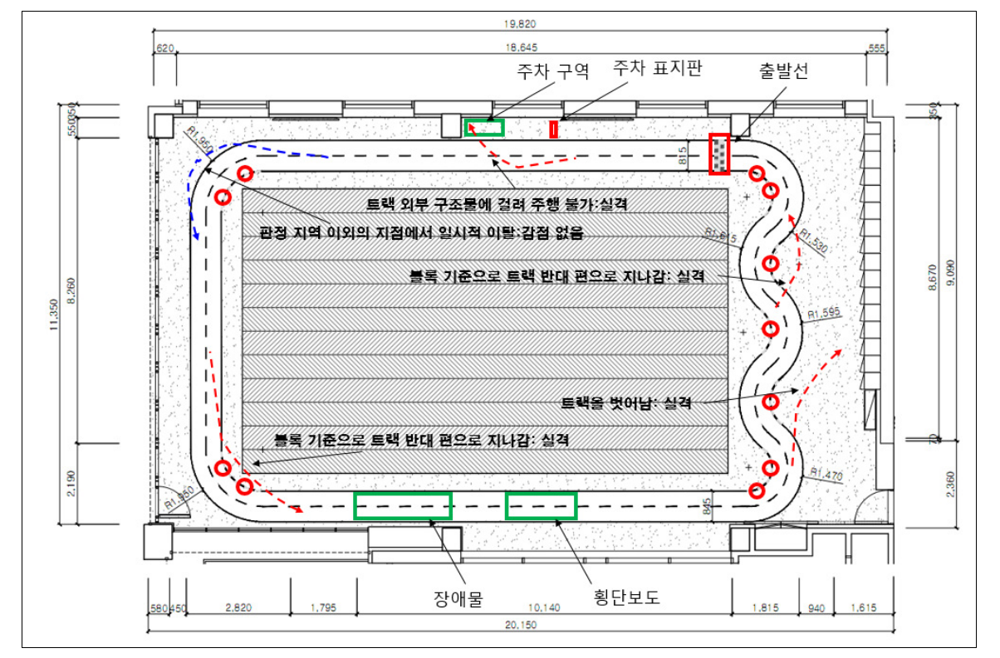
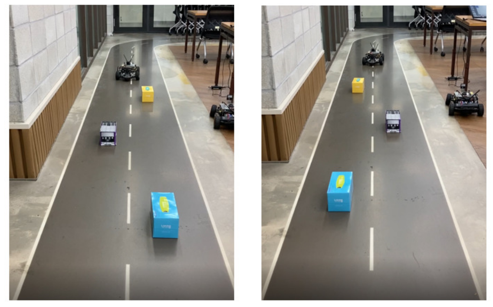
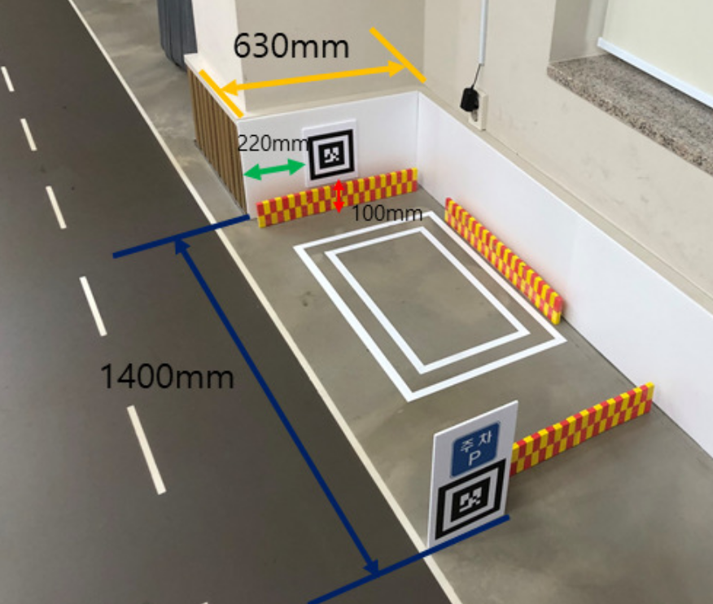

<!-- PROJECT LOGO -->
<br />
<p align="center">
  
  <h3 align="center">월간 프로젝트 3</h3>
  <p align="center">
    An awesome README template to jumpstart your projects!
    <br />
    <a href="https://github.com/othneildrew/Best-README-Template"><strong>Explore the docs »</strong></a>
    <br />
    <br />
    <a href="https://github.com/othneildrew/Best-README-Template">View Demo</a>
    ·
    <a href="https://github.com/othneildrew/Best-README-Template/issues">Report Bug</a>
    ·
    <a href="https://github.com/othneildrew/Best-README-Template/issues">Request Feature</a>
  </p>
</p>


<!-- TABLE OF CONTENTS -->
<details open="open">
  <summary>목차</summary>
  <ol>
    <li><a href="#대회-개요">대회 개요</a></li>
    <li><a href="#구성">구성</a></li>
    <li><a href="#실행">실행</a></li>
    <li><a href="#구현-과정">구현 과정</a></li>
    <li><a href="#영상">영상</a></li>
  </ol>
</details>

<br>

<!-- ABOUT THE PROJECT -->
## 대회 개요

총 4개의 미션을 수행

### 1. 차선 주행

* 주어진 트랙을 영상처리를 통해 차선 이탈 없이 3바퀴 주행



### 2. 장애물 회피

* 3개의 장애물을 라이더 센서를 통해 충동하지 않고 주행



### 3. 정지선 정차

* 정지선을 인식하여 적정 범위 내에서 5초간 정차


### 4. 평행 주차

* 3바퀴 주행 후 AR 태그를 인식하여 표시된 위치에 주차



<br>


## 구성

```
project3/main
  └─ main.py : 최종 실행파일
  └─ Timer.py : 클래스간 시간 동기화
  └─ XycarSensor.py : 센서값을 읽고 저장
  └─ Xycar.py : 메인 클래스
  └─ Detector
  │    └─ BEV.py : 영상처리전 calibration / warp
  │    └─ LaneDetector.py : 차선 검출기
  │    └─ StopLineDetector.py : 정지선 검출기
  │    └─ ObstacleDetector.py : 장애물 검출기
  └─ Controller.py
       └─ ModeController.py : 구간 인식기
       └─ StanleyController.py : 차선 추종 주행 제어기
       └─ ARController.py : 정밀 주차 제어기
```
<br>

## 실행

### 1. 영상처리 테스트

* `roslaunch project3 test.launch`
* 차량을 주행시키 않고 rosbag 파일을 통해서 영상처리 확인

### 2. 자이카 주행

* `roslaunch project3 autodrive.launch`
* 차량 주행 런치파일


<br>

## 구현 과정

### 차선 추종 (허프만)

* 기존 방식의 문제점

  1. 단순 P제어만을 쓴 경우 oscillation이 크다 (속도 25 이상에서 매우 불안정)
  2. 정적 ROI를 사용하여 양쪽 차선만을 검출하므로 급격하게 꺾이는 코너나 S자 코스에서 차선을 놓치는 경우가 발생.
  3. 조명에 의해 도로에서 반사되는 빛에 취약

* 개선 방향

  * Stanley method 적용 : yaw_term과 cte_term을 독립적으로 계산하기에 oscillation이 적음 (최대 속도 50 가능)
  * 중앙선 추적 기능 적용 : 이전 차선 검출값을 이용한 동적 ROI를 적용하여 중앙선까지 인식할 수 있도록 함.
  * 차선 추적이 전 차선에 의존하므로 한 번 틀리면 계속 틀리는 경우가 생기기 때문에 예측값을 통해 보정을 함.

Before | After
|-|-|
|

<br>

### 장애물 회피

* 발생한 이슈들

  * 장애물 구간 외에 구간에서 벽을 장애물로 인식
  * 장애물 구간에서 벽을 장애물로 인식
  * 자이카가 도로와 정렬되지 않은 경우 자이카 기준 왼쪽/오른쪽이 차선 기준 왼쪽/오른쪽과 다른 경우가 생김

* 해결방안
  * 장애물 구간에서만 인식하도록 설정 (imu 센서 활용)
  * 인식 범위를 원형이 아닌 직사각형으로 설정
  * 첫번째 장애물을 조우하는 경우는 차선과 정렬 되어 있으므로 전방 라이다 사용. 그 이후의 두개의 장애물의 경우 좌우 라이더를 사용


<br>

### 정지선 인식

* bird-eye-view 와 findContour 사용
* 발생한 이슈
  * 비교적 느린 연산 속도
  * `cv2.countNonZero()` 방식을 사용하면 정지선 인식이 되긴 하나 정지선 외에 다른 지점에서도 인식.
  * 낮은 속도에서만 안정적으로 적용 (속도 20 이하)

* 해결 방안
  * bird-eye-view 와 findContour 사용 (더 엄밀한 정지선 검출 가능)
  * 장애물 구간과 가깝기 때문에 속도 대신 안정적을 선택.


<br>

### 주차

* 발생한 이슈

  * 매번 다른 위치에서 주차가 시작되어 안정된 알고리즘을 짜지기 어려움
  * 주어진 공간에 차량을 정확히 안착시키기 어려움

* 해결 방안

  * AR대신 라이더로 주변 벽을 인식하여 주차 알고리즘을 시작할 기준점을 설정
  * 후진시 yaw error을 전진시 x error를 줄이도록 구별을 하여 전후진을 여러번 반복하더라도 확실히 주차 구역 안으로 들어오게끔 설정함
  

<br>

## 영상

* 실제 주행 영상

[](https://www.youtube.com/watch?v=i_HdspQD9-w)
* 영상처리 영상

[](https://www.youtube.com/watch?v=yv8bAycMq_Y)


